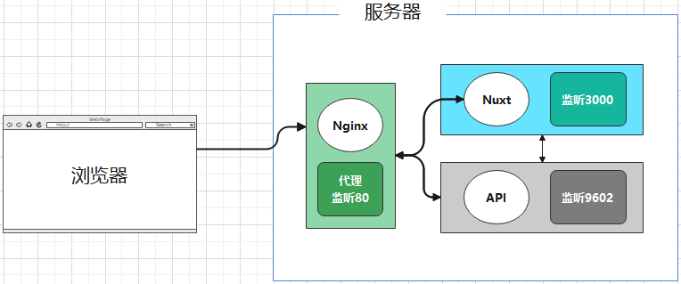

### 线上密码管理系统

前后端分离，实现基于RSA加密方式的线上多端密码存储。

基于 Nginx 代理，前后端独立部署。



### 项目介绍

#### 1. 前端工程（基于Nuxt.js）

```shell
# Web 前端
https://github.com/enqiangjing/password-online-web
# uniapp 混合应用
https://github.com/enqiangjing/password-online-uniapp
```

#### 2. 后端API（基于Spring Boot）

```shell
https://github.com/enqiangjing/password-online-api
```

#### 3.. 主仓库地址（本地址）

```shel
https://github.com/enqiangjing/password-online
```


## * 免责声明

* 本项目所有内容仅供参考和学习交流使用。
* 项目所存在的风险将由使用者自行承担，因使用本项目而产生的一切后果也由使用者自己承担。
* 凡以任何方式直接、间接使用本项目的人员，视为自愿接受本项目声明和法律法规的约束。


